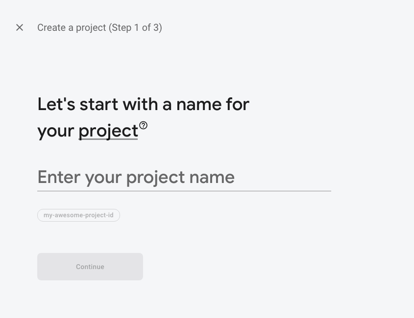
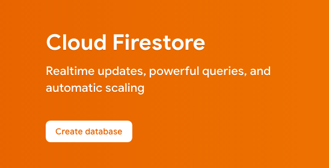
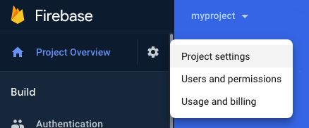
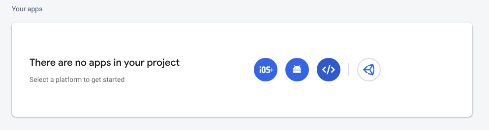
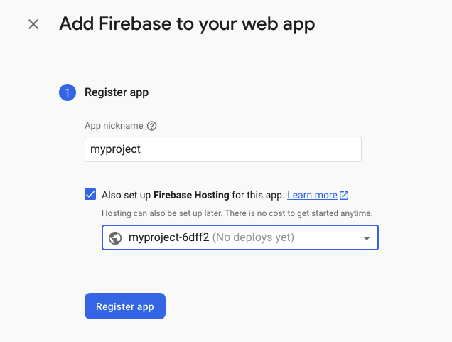

# Initial file project template made using the AlgoRaven startup code created by Anthony Krivonos (https://github.com/anthonykrivonos)

# AlgoRaven/startup


Opinionated TypeScript monorepo for Firebase projects, brought to you by the <a href="https://algoraven.com">AlgoRaven</a> team.

#### Create your full-stack web app in 4 ridiculously quick steps:

1. Define models and protocols in `idl` (interface definition language).
2. Implement protocols in the `api` with ease.
3. Call the protocols from `web` with the built-in client.
4. Deploy the whole thing to Firebase with a single `firebase deploy`.

## Getting Started

1. Clone this repo locally.
2. [Create a Firebase project](https://console.firebase.google.com/) with your choice of name.

   

3. Enable the Firestore Database by clicking `Create Database`. Choose the mode and region of your choice, but `Test` mode will help you get set up faster.

   

4. Install the Firebase CLI in your command line via `yarn install -g firebase-tools`.
5. Log into Firebase via `firebase login`.
6. Run `yarn install` to install all project dependencies.
7. Run `yarn setup` to set up the emulators.
8. Select `Use an existing project` and pick your recently created project. When asked `Which Firebase emulators do you want to set up?`, press Enter to set up defaults. Press Y and Enter to use the pre-defined ports (don't change them).
9. Go back to [Firebase](https://console.firebase.google.com/), select your app, click on `Project Settings`,

   

   create a new web app at the bottom,

   

   enable Firebase Hosting,

   

   and then click `Register app`.
10. Copy/paste the properties of `firebaseConfig` into `FIREBASE_CONFIG` in `web/src/util/env.ts`.
11. Run your app with `yarn start`. Use your app at `localhost:3000`. Use the Firebase emulators at `localhost:4269`.
12. Run `firebase deploy` to deploy both your backend and frontend. Your frontend will be available at `https://myproject.web.app` and your backend will be available at `https://us-central1-myproject.cloudfunctions.net/app`.

### Known Issues

You may be presented with the following:
```
Error: Your project myproject must be on the Blaze (pay-as-you-go) plan to complete this command. Required API cloudbuild.googleapis.com can't be enabled until the upgrade is complete. To upgrade, visit the following URL:
https://console.firebase.google.com/project/myproject/usage/details
```
In this case, you'll have to enable the Blaze plan via that URL.
